# Confluence Setup

Confluence 是一个企业级 wiki系统，让你的团队轻松地协同工作和共享知识

Confluence is a team collaboration software, Written in Java.

## Prerequisites

- Ubuntu Server 16.04
- [Java 1.8.0](./jdk-setup.md)
- Docker
- MySQL 5.7.21(based on Docker)

## MySQL config for confluence

- [install MySQL using docker](./mysql-setup.md#install-using-docker)

- 配置mysql字符集

```bash
vim /data/mysql/config/my.cnf
```

增加以下配置,并保存

```plaintext
[mysqld]
character_set_server=utf8

[client]
default-character-set=utf8
```

重启mysql

```bash
docker restart mysql
```

查看mysql字符集

```bash
mysql> show variables like 'char%';
```

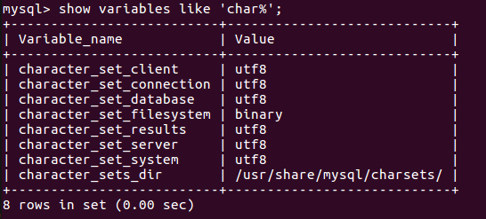

- confluence数据库配置

登陆mysql

```bash
mysql -u root -p
```

创建用户: confluence

```sql
CREATE USER 'confluence'@'%' IDENTIFIED BY 'Pass@1234';
```

创建数据库: confluence

```sql
CREATE DATABASE confluence DEFAULT CHARACTER SET utf8 COLLATE utf8_bin;
```

用户授权，并应用授权

```sql
grant all privileges on confluence.* to confluence@'%';

flush privileges;
```

## Install Confluence

- download packages

> **atlassian-confluence-6.3.1-x64.bin**  
> 链接: <https://pan.baidu.com/s/1bq5VuDx> 密码: ypvr
>
> **atlassian-extras-decoder-v2-3.2.jar**  
> 链接: <https://pan.baidu.com/s/1qZEsthq> 密码: ueej
>
> **atlassian-universal-plugin-manager-plugin-2.22.jar**  
> 链接: <https://pan.baidu.com/s/1eTSjSTc> 密码: i9d6
>
> [mysql connector for java 5.1.45](https://dev.mysql.com/downloads/connector/j/)

- intalling

安装目录```/opt/```

```bash
cd /opt/
```

修改安装文件权限，并执行

```bash
chmod +x atlassian-confluence-6.3.1-x64.bin

./atlassian-confluence-6.3.1-x64.bin
```

一路回车确定，使用默认配置(default setting)安装，如下图

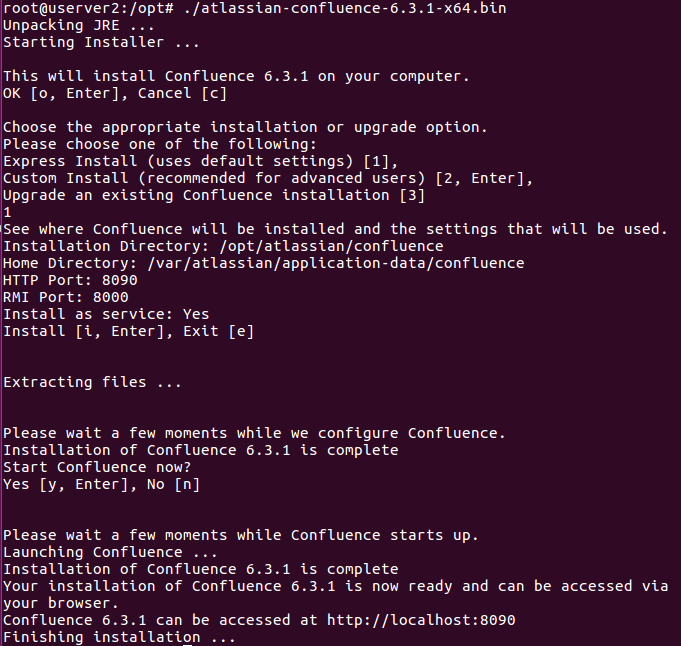

从安装过程输出信息可知  
confluence的安装目录为：```/opt/atlassian/confluence```  
confluence的数据目录为：```/var/atlassian/application-data/confluence```

confluence主要配置文件  
server配置文件：```/opt/atlassian/confluence/conf/server.xml```

- 破解

```bash
# stop confluence
/etc/init.d/confluence stop

# 替换 atlassian-extras-decoder-v2-3.2.jar.用来破解
cp atlassian-extras-decoder-v2-3.2.jar /opt/atlassian/confluence/confluence/WEB-INF/lib/

# 替换 atlassian-universal-plugin-manager-plugin-2.22.jar
cp atlassian-universal-plugin-manager-plugin-2.22.jar /opt/atlassian/confluence/confluence/WEB-INF/atlassian-bundled-plugins/

# 替换 mysql-connector-java-5.1.45-bin.jar，用来连接mysql
cp mysql-connector-java-5.1.45-bin.jar /opt/atlassian/confluence/lib/

# start confluence
/etc/init.d/confluence start
```

- Config in the browser

使用浏览器访问confluence

```bash
http://server_ip:8090
```

安装类型步骤，选择“产品安装”, “语言”选择“中文”，下一步  
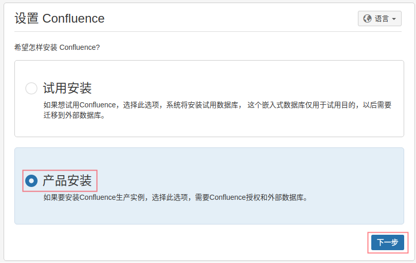

获得插件步骤，**不要勾选任何插件**，下一步  
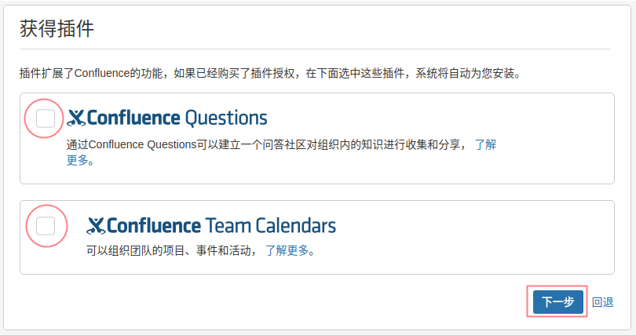

授权码步骤：点击"获取试用授权"，（需要翻墙）使用自己的google账户登陆Atlassian  


选择License类型为“Confluence(Server)”,并生成license  
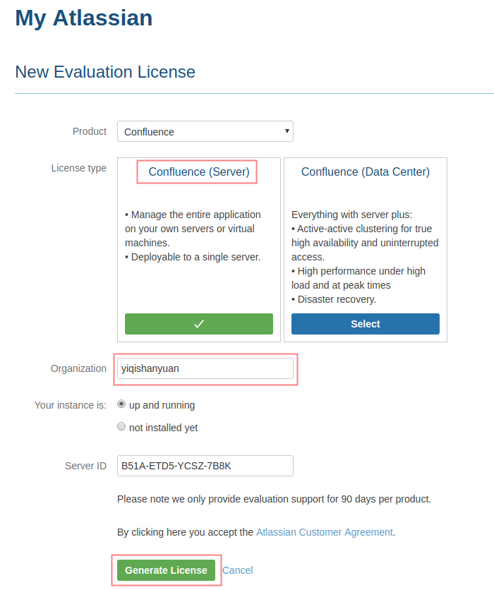

弹出的确认框中，点击“Yes”  
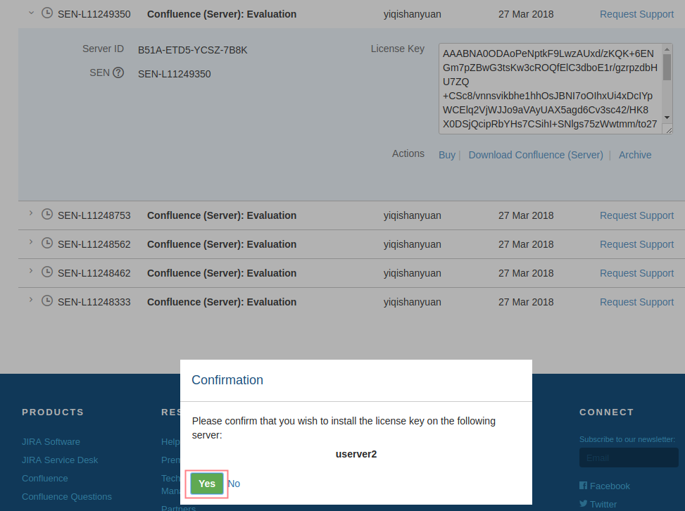

授权码会自动填充到授权码文本框，下一步  
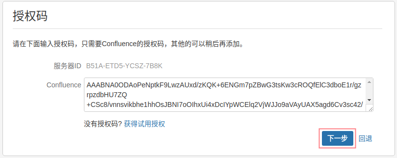

选择数据库设置步骤：选择“MySQL”，点击页面"外部数据库"，下一步  


配置数据库步骤：选择"JDBC连接",进行设置，下一步  
  
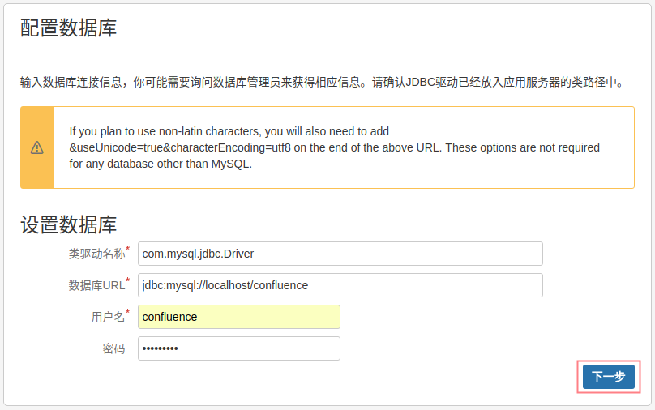  

加载内容步骤：选择“空白站点”，下一步  
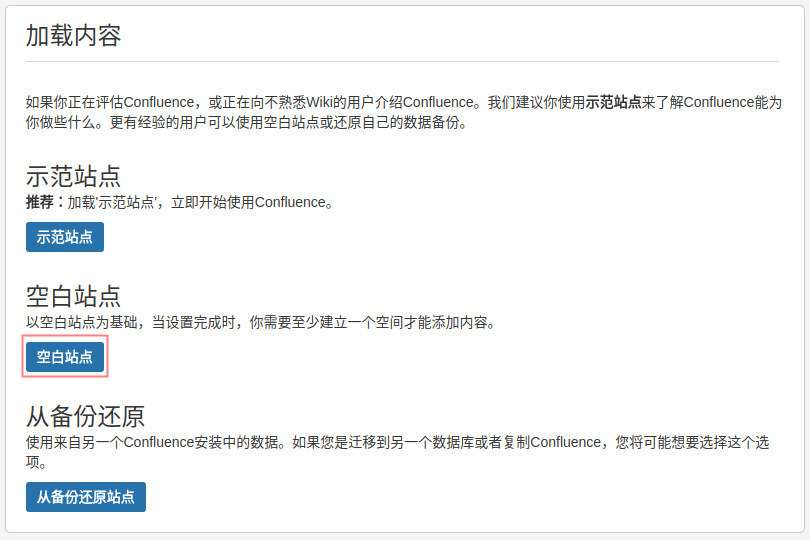

配置用户管理步骤：选择“在confluence中管理用户和组”，下一步  
> 如果要与jira集成，选择"与JIRA连接"  

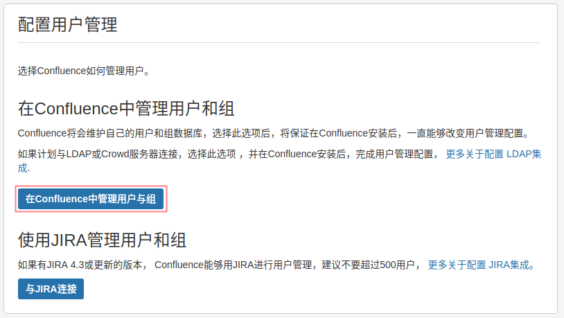

配置系统管理员账户步骤：设置管理员名称和密码  
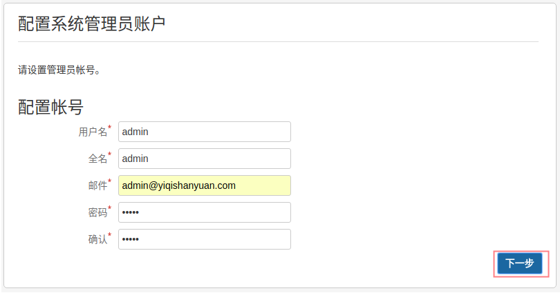

Finish.  


查看License，可以看到我们已成功破解Confluence。  
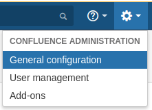  
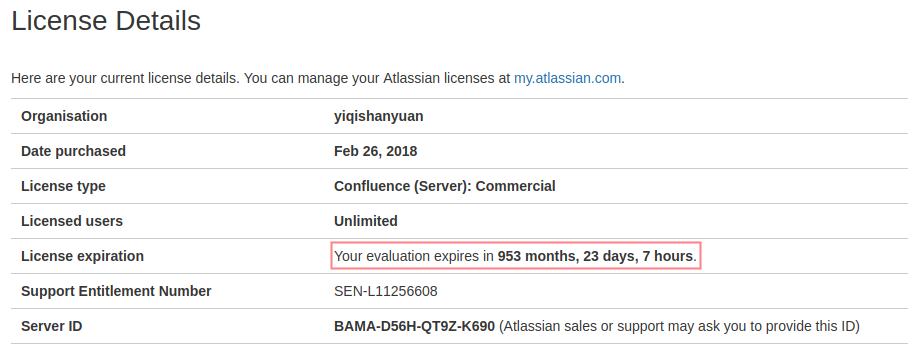  

## Uninstall Confluence

- stop confluence service

```bash
/etc/init.d/confluence stop
```

- uninstalling

```bash
# 进入confluence安装目录
cd /opt/atlassian/confluence

# 执行uninstall命令
./uninstall
```

- remove application-data、logs etc.

```bash
rm -r /opt/atlassian/confluence
rm -r /var/atlassian/application-data/confluence
```

## Reference

- [散尽浮华 cnblogs install confluence](https://www.cnblogs.com/kevingrace/p/7607442.html)
- [demo confluence](http://www.confluence.cn)
- [Comparison of wiki software](https://en.wikipedia.org/wiki/Comparison_of_wiki_software)
- [wiki Confluence](https://en.wikipedia.org/wiki/Confluence_(software))
- [Uninstalling Confluence from Linux](https://confluence.atlassian.com/doc/uninstalling-confluence-from-linux-255362396.html)
