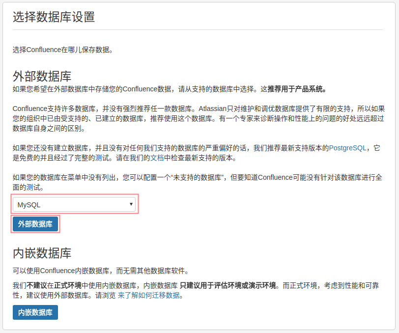

# Confluence Setup

Confluence 是一个企业级 wiki系统，让你的团队轻松地协同工作和共享知识

Confluence is a team collaboration software, Written in Java.

## Prerequisites

- Ubuntu Server 16.04
- Java 1.8.0
- MySQL 5.7.21
- [mysql connector for java 5.1.45](https://dev.mysql.com/downloads/connector/j/)

## MySQL config for confluence

- 配置mysql字符集

```bash
vim /etc/mysql/conf.d/mysqld.cnf
```

添加如下配置,并保存

```plaintext
[mysqld]
character_set_server=utf8
```

重启mysql

```bash
service mysql restart
```

查看mysql字符集

```bash
show variables like 'char%';
```


- confluence数据库配置

登陆mysql

```bash
mysql -u root -p
```

创建用户: confluence

```sql
CREATE USER 'confluence'@'localhost' IDENTIFIED BY 'Pass@1234';
```

创建数据库: confluence

```sql
CREATE DATABASE confluence DEFAULT CHARACTER SET utf8 COLLATE utf8_general_ci；
```

用户授权，并应用授权

```sql
grant all privileges on confluence.* to confluence@localhost;

flush privileges;
```

## Install Confluence

- download packages

```plaintext
atlassian-confluence-6.3.1-x64.bin
链接: [https://pan.baidu.com/s/1bq5VuDx](https://pan.baidu.com/s/1bq5VuDx) 密码: ypvr

atlassian-extras-decoder-v2-3.2.jar
链接: [https://pan.baidu.com/s/1qZEsthq](https://pan.baidu.com/s/1qZEsthq) 密码: ueej

atlassian-universal-plugin-manager-plugin-2.22.jar
链接: [https://pan.baidu.com/s/1eTSjSTc](https://pan.baidu.com/s/1eTSjSTc) 密码: i9d6
```

- intalling

安装目录```/opt/```

```bash
cd /opt/
```

修改安装文件权限，并执行

```bash
chmod +x atlassian-confluence-6.3.1-x64.bin

./atlassian-confluence-6.3.1-x64.bin
```

一路回车确定，使用默认配置(default setting)安装，如下图


- Config in the browser

使用浏览器访问confluence

```bash
http://server_ip:8090
```

安装类型步骤，选择“产品安装”, “语言”选择“中文”，下一步  


获得插件步骤，**不要勾选任何插件**，下一步  


授权码步骤： 1. 先使用破解补丁替换原文件

```bash
# stop confluence
/etc/init.d/confluence stop

# 替换 atlassian-extras-decoder-v2-3.2.jar
cp atlassian-extras-decoder-v2-3.2.jar /opt/atlassian/confluence/confluence/WEB-INF/lib/

# 替换 atlassian-universal-plugin-manager-plugin-2.22.jar
cp atlassian-universal-plugin-manager-plugin-2.22.jar /opt/atlassian/confluence/confluence/WEB-INF/atlassian-bundled-plugins/

# start confluence
/etc/init.d/confluence start
```

授权码步骤： 2. 点击"获取试用授权"，（需要翻墙）使用自己的google账户登陆Atlassian  


选择License类型为“Confluence(Server)”,并生成license  


弹出框中，点击“Yes”  


授权码会自动填充到授权码文本框，下一步  


选择数据库设置步骤： 1. 选择”MySQL“（先不要点击“外部数据库”）

选择数据库设置步骤： 2. 复制已经下载的mysql-connector-java到confluence安装目录

[download mysql connector for java](https://dev.mysql.com/downloads/connector/j/)

```bash
# copy
cp mysql-connector-java-5.1.45-bin.jar /opt/atlassian/confluence/lib/

# restart confluence
/etc/init.d/confluence restart
```

选择数据库设置步骤： 3.点击页面"外部数据库"，下一步  


配置数据库步骤：选择"JDBC连接",进行设置，下一步  


加载内容步骤：选择“空白站点”，下一步  


配置用户管理步骤：选择“在confluence中管理用户和组”，下一步  


配置系统管理员账户步骤：设置管理员名称和密码  


Finish.  


## Reference

- [散尽浮华 cnblogs install confluence](https://www.cnblogs.com/kevingrace/p/7607442.html)
- [demo confluence](http://www.confluence.cn)
- [Comparison of wiki software](https://en.wikipedia.org/wiki/Comparison_of_wiki_software)
- [wiki Confluence](https://en.wikipedia.org/wiki/Confluence_(software))
