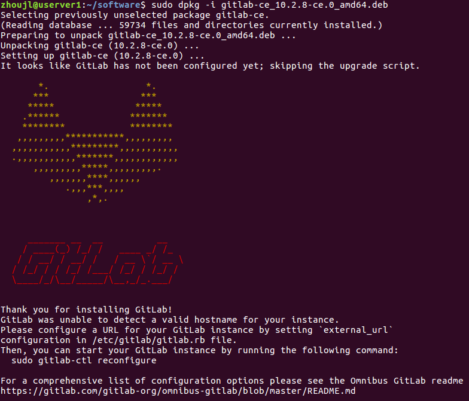

# Gitlab Server Setup

- [Install using downloaded packages](#Install%20using%20downloaded%20packages)
- [Install using APT](#Install%20using%20APT)
- [Install using docker](#Install%20using%20docker)

## Environment

- ubuntu server 16.04

## Install using downloaded packages

- installing

```bash
sudo apt-get install openssh-server

## email support, sendmail or exim is also OK
# sudo apt-get install postfix

sudo dpkg -i gitlab-ce_10.2.8-ce.0_amd64.deb
```

dpkg -i会需要一段时间，安装完成提示如下



使用默认配置启动gitlab server

```bash
sudo gitlab-ctl reconfigure
```

check install

```bash
sudo gitlab-ctl status
# or
sudo gitlab-ctl service-list
# or in browser
http://IP_ADDR
```

- uninstalling

```bash
# Stop gitlab and remove its supervision process
sudo gitlab-ctl uninstall

# Debian/Ubuntu
sudo dpkg -r gitlab
```

### Directory structure

Omnibus-gitlab uses four different directories.

- ```/opt/gitlab``` holds application code for GitLab and its dependencies.
- ```/var/opt/gitlab``` holds application data and configuration files that gitlab-ctl reconfigure writes to.
- ```/etc/gitlab``` holds configuration files for omnibus-gitlab. These are the only files that you should ever have to edit manually.
- ```/var/log/gitlab``` contains all log data generated by components of omnibus-gitlab.

## Install using APT

- installing

```bash
curl -s https://packages.gitlab.com/install/repositories/gitlab/gitlab-ce/script.deb.sh | sudo bash
sudo apt-get install gitlab-ce=10.2.8-ce.0
```

- uninstalling

```bash
sudo apt-get purge gitlab-ce
# sudo apt-get remove gitlab-ce

sudo rm -r /opt/gitlab/
sudo rm -r /var/opt/gitlab/
sudo rm -r /etc/gitlab/
sudo rm -r /var/log/gitlab/
```

## Install using docker

- download images

```bash
docker pull gitlab/gitlab-ce
```

- config data volumes

```bash
mkdir -p /data/gitlab

cd /data/gitlab
mkdir config data logs

# config: 配置文件目录
# data: 数据目录
# logs: 日志目录
```

- docker run

//--env GITLAB_SSH_PORT=2220 \

```bash
docker run --detach \
    --publish 4430:443 --publish 8000:80 --publish 2220:22 \
    --name gitlab \
    --hostname gitlab.example.com \
    --restart always \
    --volume /data/gitlab/config:/etc/gitlab \
    --volume /data/gitlab/logs:/var/log/gitlab \
    --volume /data/gitlab/data:/var/opt/gitlab \
    gitlab/gitlab-ce:latest
```

## Reference

- [administration doc](https://docs.gitlab.com/ce/administration/index.html)
- [omnibus doc](https://docs.gitlab.com/omnibus/README.html)
- [default setting templete](https://gitlab.com/gitlab-org/omnibus-gitlab/blob/master/files/gitlab-config-template/gitlab.rb.template)
- [docker-ce available packages](https://packages.gitlab.com/gitlab/gitlab-ce)
- [docker-ce docker images](https://docs.gitlab.com/omnibus/docker/)
