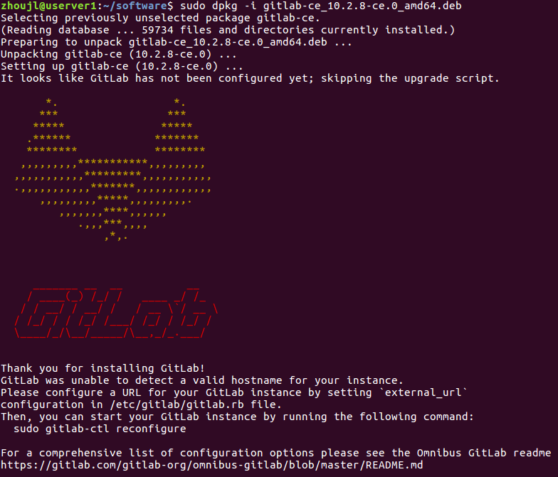
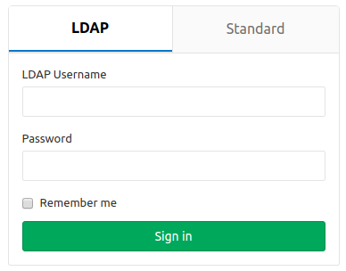
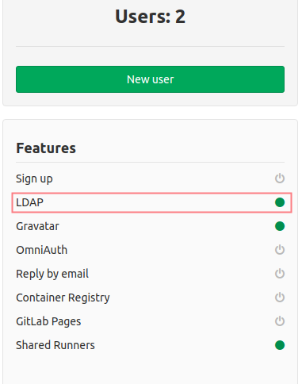
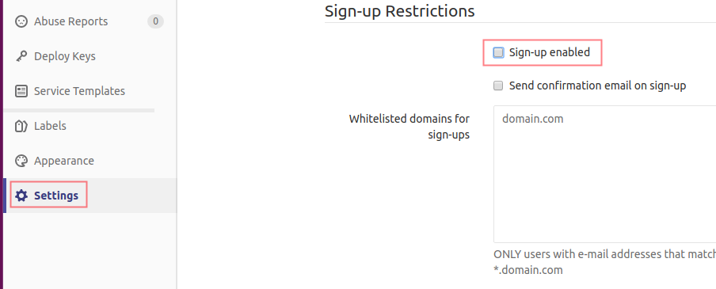

# Gitlab Server Setup

- [Install using downloaded packages](#install-using-downloaded-packages)
- [Install using APT](#install-using-apt)
- [Install using docker](#install-using-docker)

## Prerequisites

- ubuntu server 16.04

## Install using downloaded packages

- installing

```bash
sudo apt-get install openssh-server

## email support, sendmail or exim is also OK
# sudo apt-get install postfix

sudo dpkg -i gitlab-ce_10.2.8-ce.0_amd64.deb
```

dpkg -i会需要一段时间，安装完成提示如下



使用默认配置启动gitlab server

```bash
sudo gitlab-ctl reconfigure
```

check install

```bash
sudo gitlab-ctl status
# or
sudo gitlab-ctl service-list
# or in browser
http://IP_ADDR
```

- uninstalling

```bash
# Stop gitlab and remove its supervision process
sudo gitlab-ctl uninstall

# Debian/Ubuntu
sudo dpkg -r gitlab
```

### Directory structure

Omnibus-gitlab uses four different directories.

- ```/opt/gitlab``` holds application code for GitLab and its dependencies.
- ```/var/opt/gitlab``` holds application data and configuration files that gitlab-ctl reconfigure writes to.
- ```/etc/gitlab``` holds configuration files for omnibus-gitlab. These are the only files that you should ever have to edit manually.
- ```/var/log/gitlab``` contains all log data generated by components of omnibus-gitlab.

## Install using APT

- installing

```bash
curl -s https://packages.gitlab.com/install/repositories/gitlab/gitlab-ce/script.deb.sh | sudo bash
sudo apt-get install gitlab-ce=10.2.8-ce.0
```

- uninstalling

```bash
sudo apt-get purge gitlab-ce
# sudo apt-get remove gitlab-ce

sudo rm -r /opt/gitlab/
sudo rm -r /var/opt/gitlab/
sudo rm -r /etc/gitlab/
sudo rm -r /var/log/gitlab/
```

## Install using docker

- download images

```bash
docker pull gitlab/gitlab-ce
```

- docker run

```bash
docker run --detach \
    --publish 4430:443 --publish 8600:80 --publish 2220:22 \
    --name gitlab \
    --hostname gitlab.example.com \
    --restart always \
    --volume /data/gitlab/config:/etc/gitlab \
    --volume /data/gitlab/logs:/var/log/gitlab \
    --volume /data/gitlab/data:/var/opt/gitlab \
    gitlab/gitlab-ce:latest
```

配置说明

```bash
# 配置文件目录
/data/gitlab/config
# 日志目录
/data/gitlab/logs
# 数据目录
/data/gitlab/data
```

## 配置HTTPS与SSH端口

- 生成证书

```bash
mkdir /data/gitlab/config/ssl

openssl req -new -newkey rsa:4096 -days 365 -nodes -x509 -subj "/C=CN/ST=Beijing/L=Chaoyang/O=yiqishanyuan/CN=yiqishanyuan.com" -keyout /data/gitlab/config/ssl/yiqishanyuan.com.key -out /data/gitlab/config/ssl/yiqishanyuan.com.crt
```

参数说明

```bash
# C=国家或地区 | ST=省、自治区或直辖市名 | L=位置名 | O=组织名称 | CN=公共名
-subj "/C=CN/ST=Beijing/L=Chaoyang/O=yiqishanyuan/CN=yiqishanyuan.com"
```

- 修改配置文件

```bash
vim /data/gitlab/config/gitlab.rb
```

在文件底部添加以下内容

```bash
# HTTPS Settings
# DOC: https://docs.gitlab.com/omnibus/settings/nginx.html
# Setting external_url
external_url "https://userver1:4430"

# Setting the NGINX listen port
nginx['listen_port'] = 443

# Redirect HTTP requests to HTTPS
nginx['redirect_http_to_https'] = true

# ssl证书
nginx['ssl_certificate'] = "/etc/gitlab/ssl/yiqishanyuan.com.crt"
nginx['ssl_certificate_key'] = "/etc/gitlab/ssl/yiqishanyuan.com.key"

# Change the default proxy header
nginx['proxy_set_headers'] = {
"X-Forwarded-Proto" => "https",
"X-Forwarded-Ssl" => "on",
}

# ssh port
gitlab_rails['gitlab_shell_ssh_port'] = 2220
```

- 重启gitlab服务

```bash
docker restart gitlab
```

## 配置LDAP

> 假设LDAP server已经正常运行

- 修改配置文件

```bash
vim /data/gitlab/config/gitlab.rb
```

在文件底部添加以下内容

```bash
# LDAP Settings
# DOC: https://docs.gitlab.com/omnibus/settings/ldap.html
gitlab_rails['ldap_enabled'] = true
gitlab_rails['ldap_servers'] = YAML.load <<-EOS # remember to close this block with 'EOS' below
main: # 'main' is the GitLab 'provider ID' of this LDAP server
  label: 'LDAP'
  host: 'ldap.example.org'
  encryption: 'plain'
  port: 389 # or 636
  uid: 'sn'
  method: 'plain' # "tls" or "ssl" or "plain"  
  bind_dn: 'cn=admin,dc=yiqishanyuan,dc=com'
  password: 'admin'
  active_directory: false
  allow_username_or_email_login: true  
  lowercase_usernames: false
  base: 'ou=users,dc=yiqishanyuan,dc=com'
  user_filter: ''
EOS
```

- 配置gitlab服务的hosts

> 如果```gitlab_rails['ldap_servers']```的host配置项使用域名配置，则需要配置gitlab服务的hosts

```bash
docker exec gitlab bash -c "echo $(docker inspect -f "{{ .NetworkSettings.IPAddress }}" ldap-service) ldap.example.org >> /etc/hosts"
```

- 重启gitlab服务

```bash
docker restart gitlab
```

- 检查配置

重新登陆gitlab时，发现多了一个“LDAP”的tab页  


登陆后进入系统管理，发现“LDAP”的Feature已经开启  


## 禁用gitlab注册用户

使用管理员账户登陆gitlab，进入管理界面  
  

在“settings”菜单选项中，禁用注册用户  
  

## Reference

- [administration doc](https://docs.gitlab.com/ce/administration/index.html)
- [omnibus doc](https://docs.gitlab.com/omnibus/README.html)
- [default setting templete](https://gitlab.com/gitlab-org/omnibus-gitlab/blob/master/files/gitlab-config-template/gitlab.rb.template)
- [docker-ce available packages](https://packages.gitlab.com/gitlab/gitlab-ce)
- [docker-ce docker guide](https://docs.gitlab.com/omnibus/docker/)
- [专有名称 (DN) 属性说明](https://www.ibm.com/support/knowledgecenter/zh/SSCGGQ_1.2.0/com.ibm.ism.doc/Reference/_Topics/sy10570_.html)
- [gitlab ldap guide](https://docs.gitlab.com/ce/administration/auth/ldap.html)
- [install ldap in ubuntu (digtalocean)](https://www.digitalocean.com/community/tutorials/how-to-install-and-configure-a-basic-ldap-server-on-an-ubuntu-12-04-vps)