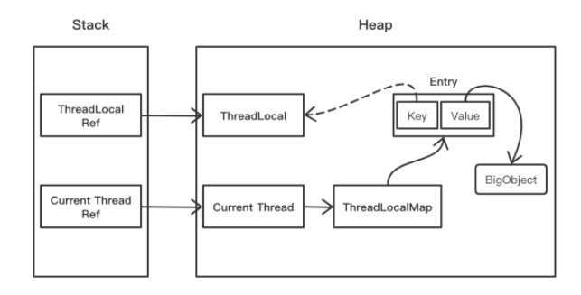

# ThreadLocal

ThreadLocal的作用主要是做数据隔离，填充的数据只属于当前线程，变量的数据对别的线程而言是相对隔离的；

## 问题

- 应用场景
- ThreadLocalMap 为什么使用弱引用？多了一层保障，参考ThreadLocal内存模型
- 内存泄漏，最佳实践
- 异步场景下 ThreadLocal 的问题

## 应用场景

- Spring的事务主要是ThreadLocal和AOP去做实现的，TransactionSynchronizationManager

## 原理

类 Thread.java
- threadLocals 私有变量，threadLocals依赖ThreadLocalMap存储当前线程的值，对于调用方而言，key是当前线程

```java 
    /* ThreadLocal values pertaining to this thread. This map is maintained
     * by the ThreadLocal class. */
    ThreadLocal.ThreadLocalMap threadLocals = null;

```

类ThreadLocal可以理解为对ThreadLocalMap的封装   
ThreadLocal的主要方法
- get()
- set()
- remove()

```java
    /**
     * Returns the value in the current thread's copy of this
     * thread-local variable.  If the variable has no value for the
     * current thread, it is first initialized to the value returned
     * by an invocation of the {@link #initialValue} method.
     *
     * @return the current thread's value of this thread-local
     */
    public T get() {
        Thread t = Thread.currentThread();
        ThreadLocalMap map = getMap(t);
        if (map != null) {
            ThreadLocalMap.Entry e = map.getEntry(this);
            if (e != null) {
                @SuppressWarnings("unchecked")
                T result = (T)e.value;
                return result;
            }
        }
        return setInitialValue();
    }
    /**
     * Get the map associated with a ThreadLocal. Overridden in
     * InheritableThreadLocal.
     *
     * @param  t the current thread
     * @return the map
     */
    ThreadLocalMap getMap(Thread t) {
        return t.threadLocals;
    }

    /**
     * Sets the current thread's copy of this thread-local variable
     * to the specified value.  Most subclasses will have no need to
     * override this method, relying solely on the {@link #initialValue}
     * method to set the values of thread-locals.
     *
     * @param value the value to be stored in the current thread's copy of
     *        this thread-local.
     */
    public void set(T value) {
        Thread t = Thread.currentThread();
        ThreadLocalMap map = getMap(t);
        if (map != null)
            map.set(this, value);
        else
            createMap(t, value);
    }

    /**
     * Removes the current thread's value for this thread-local
     * variable.  If this thread-local variable is subsequently
     * {@linkplain #get read} by the current thread, its value will be
     * reinitialized by invoking its {@link #initialValue} method,
     * unless its value is {@linkplain #set set} by the current thread
     * in the interim.  This may result in multiple invocations of the
     * {@code initialValue} method in the current thread.
     *
     * @since 1.5
     */
     public void remove() {
         ThreadLocalMap m = getMap(Thread.currentThread());
         if (m != null)
             m.remove(this);
     }
```

ThreadLocalMap是ThreadLocal的内部静态类   


```java

    /**
     * ThreadLocalMap is a customized hash map suitable only for
     * maintaining thread local values. No operations are exported
     * outside of the ThreadLocal class. The class is package private to
     * allow declaration of fields in class Thread.  To help deal with
     * very large and long-lived usages, the hash table entries use
     * WeakReferences for keys. However, since reference queues are not
     * used, stale entries are guaranteed to be removed only when
     * the table starts running out of space.
     */
    static class ThreadLocalMap {
        /**
         * The table, resized as necessary.
         * table.length MUST always be a power of two.
         */
        private Entry[] table;
        /**
         * The entries in this hash map extend WeakReference, using
         * its main ref field as the key (which is always a
         * ThreadLocal object).  Note that null keys (i.e. entry.get()
         * == null) mean that the key is no longer referenced, so the
         * entry can be expunged from table.  Such entries are referred to
         * as "stale entries" in the code that follows.
         */
        static class Entry extends WeakReference<ThreadLocal<?>> {
            /** The value associated with this ThreadLocal. */
            Object value;

            Entry(ThreadLocal<?> k, Object v) {
                super(k);
                value = v;
            }
        }

        /**
         * Construct a new map initially containing (firstKey, firstValue).
         * ThreadLocalMaps are constructed lazily, so we only create
         * one when we have at least one entry to put in it.
         */
        ThreadLocalMap(ThreadLocal<?> firstKey, Object firstValue) {
            table = new Entry[INITIAL_CAPACITY];
            int i = firstKey.threadLocalHashCode & (INITIAL_CAPACITY - 1);
            table[i] = new Entry(firstKey, firstValue);
            size = 1;
            setThreshold(INITIAL_CAPACITY);
        }
    }
```

## TheadLocal 内存模型



## reference

- https://mp.weixin.qq.com/s/Gf4MiHPz8DynY80UmwH04Q
- 强软弱虚4种引用 https://juejin.cn/post/6844903665241686029
