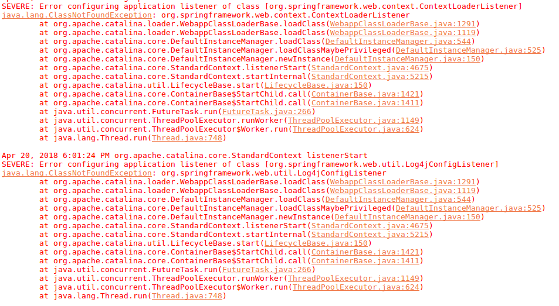

# Eclipse 开发错误处理

## Config Error 01

问题截图



解决办法 [链接](https://stackoverflow.com/questions/6210757/java-lang-classnotfoundexception-org-springframework-web-context-contextloaderl)

```text
1.Open the project's properties (e.g., right-click on the project's name in the project explorer and select "Properties").
2.Select "Deployment Assembly".
3.Click the "Add..." button on the right margin.
4.Select "Java Build Path Entries" from the menu of Directive Type and click "Next".
5.Select "Maven Dependencies" from the Java Build Path Entries menu and click "Finish".
```
