# Jenkins Setup

Jenkins is an open source automation server written in Java.

Jenkins helps to automate the non-human part of software development process, with **continuous integration** and facilitating technical aspects of **continuous delivery**.

## Depends

- [Java8](./install-jdk.md)
- [Docker](./install-docker-ce.md)

## Install using docker

- insall

```bash
docker run \
  -u root \
  -d \
  -p 8080:8080 \
  -p 50000:50000 \
  -v /data/jenkins:/var/jenkins_home \
  -v /var/run/docker.sock:/var/run/docker.sock \
  --name jenkins-blueocean \
  jenkinsci/blueocean
```

docker run -itd -p 8080:8080 -p 50000:50000 --name jenkins --privileged=true  -v /data/jenkins:/var/jenkins_home jenkins

- unlocking jenkins

浏览器打开jenkins

```bash
http://serverIP:8080
```

查看并输入initialAdminPassword

```bash
cat /data/jenkins/secrets/initialAdminPassword
```

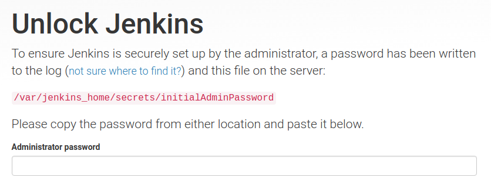

选择安装推荐的插件  
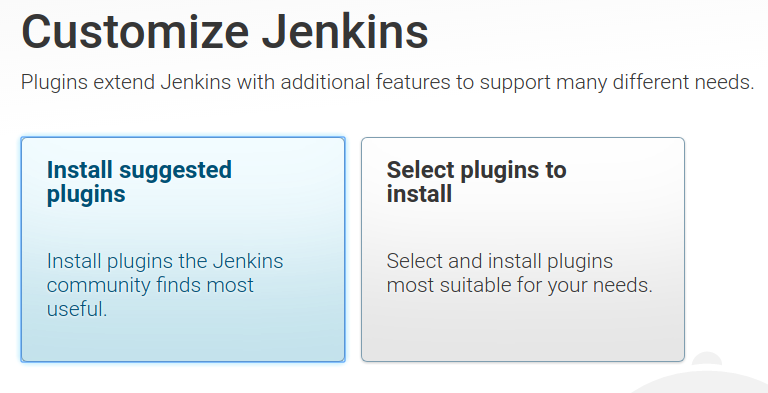  
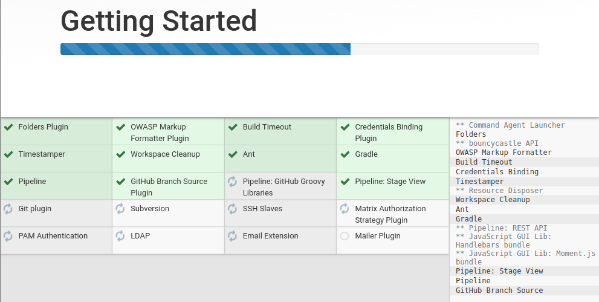

- 创建第一个admin用户

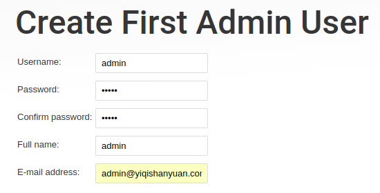

## 配置LDAP

- 使用管理员账户登陆jenkins

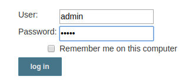

- "Manager Jenkis" --> "Configure Global Security"

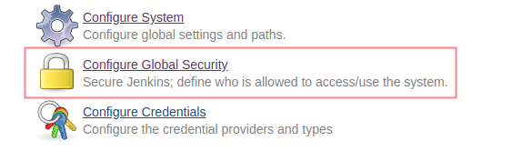

- "Security Realm" 选择 "LDAP",配置如下(根据个人情况修改相关参数)

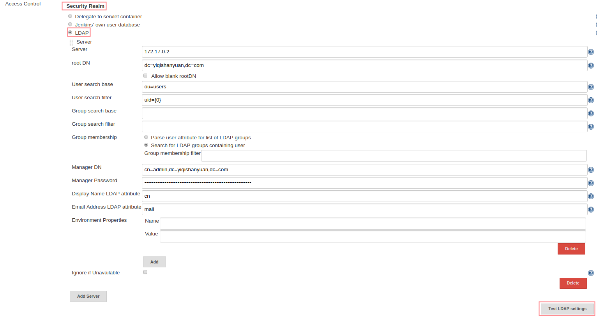

- 配置完成，点击"Test LDAP settins"进行测试

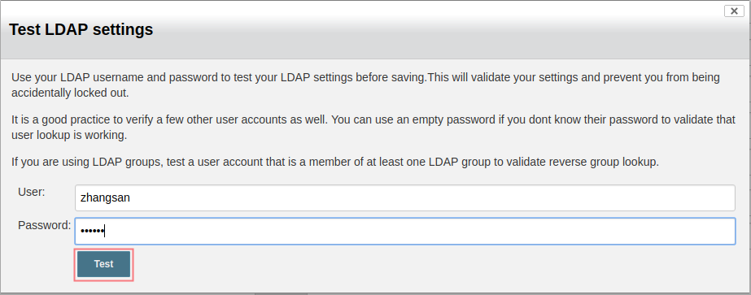  
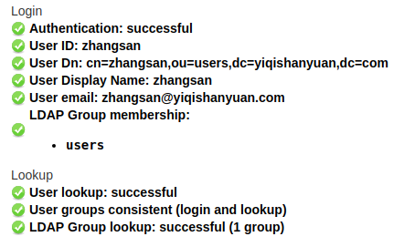

- 授权配置

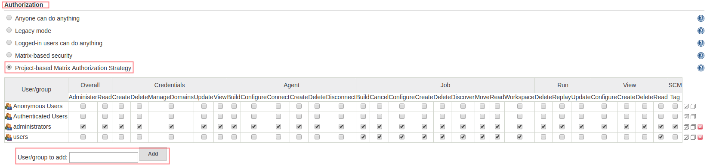  

- 至此，LDAP已配置完成，可以使用LDAP中的用户登陆jenkins

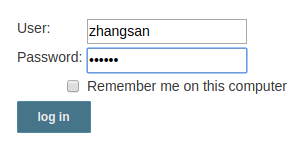

### Pipeline

Jenkins Pipeline is a suite of plugins which supports implementing and integrating **continuous delivery pipelines** into Jenkins.

The definition of a Jenkins Pipeline is written into a text file ,called a Jenkinsfile.

[see more ..](https://jenkins.io/doc/book/pipeline/)

### Blue Ocean

Blue Ocean rethinks the user experience of Jenkins.

[see more ..](https://jenkins.io/doc/book/blueocean/)

## gitlab integration

在执行docker run时，增加如下配置，即不需进入jenkins container配置hosts访问gitlab

```bash
  --add-host=gitlab.example.com:192.168.1.20
```

## reference

- [jenkins.io/doc](https://jenkins.io/doc/)
- [Comparison of continuous integration software](https://en.wikipedia.org/wiki/Comparison_of_continuous_integration_software)
- [jenkins gitlab plugin](https://github.com/jenkinsci/gitlab-plugin)
- [jenkins ldap plugin](https://plugins.jenkins.io/ldap)