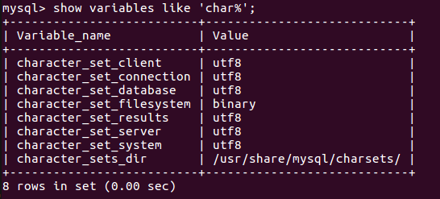
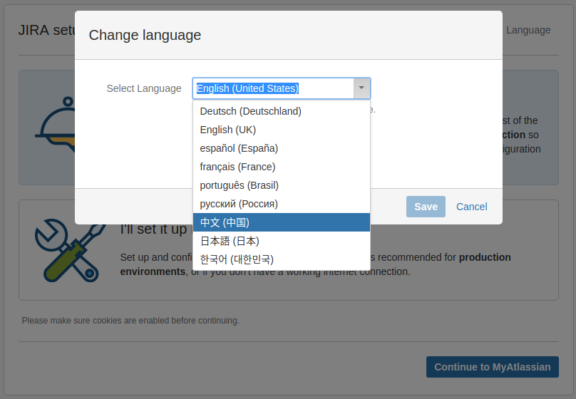

# JIRA Setup

jira是Atlassian公司出品的项目与事务跟踪工具，被广泛应用于缺陷跟踪（bug管理）、客户服务、需求收集、流程审批、任务跟踪、项目跟踪和敏捷管理等工作领域。

## Prerequisites

- Ubuntu Server 16.04
- Java 1.8.0
- MySQL 5.7.21

## MySQL config for jira

- 配置mysql字符集

```bash
vim /etc/mysql/conf.d/mysqld.cnf
```

添加如下配置,并保存

```plaintext
[mysqld]
character_set_server=utf8
```

重启mysql

```bash
service mysql restart
```

查看mysql字符集

```bash
show variables like 'char%';
```



- jira数据库配置

登陆mysql

```bash
mysql -u root -p
```

创建用户: jira

```sql
CREATE USER 'jira'@'localhost' IDENTIFIED BY 'Pass@1234';
```

创建数据库: jira

```sql
CREATE DATABASE jira DEFAULT CHARACTER SET utf8 COLLATE utf8_general_ci;
```

用户授权，并应用授权

```sql
grant all privileges on jira.* to jira@localhost;

flush privileges;
```

## Install jira

- download packages

> **atlassian-jira-software-7.4.1-x64.bin**  
> 链接: https://pan.baidu.com/s/1htFoB4o 密码: p533
>
> **atlassian-extras-3.2.jar**  
> 链接: https://pan.baidu.com/s/1kWPrSIN 密码: 3spu
>
> [mysql connector for java 5.1.45](https://dev.mysql.com/downloads/connector/j/)

- installing

安装目录```/opt/```

```bash
cd /opt/
```

修改安装文件权限，并执行

```bash
chmod +x atlassian-confluence-6.3.1-x64.bin

./atlassian-confluence-6.3.1-x64.bin
```

一路回车确定，使用默认配置(default setting)安装，如下图


从安装过程输出信息可知  
jira的安装目录为：```/opt/atlassian/jira```  
jira的数据目录为：```/var/atlassian/application-data/jira```  

jira的主要配置文件  
server配置文件：```/opt/atlassian/jira/conf/server.xml```  
database配置文件：```/var/atlassian/application-data/jira/dbconfig.xml```  

- 破解

```bash
# stop jira
/etc/init.d/jira stop

# 替换 atlassian-extras-3.2.jar，用来破解
cp atlassian-extras-3.2.jar /opt/atlassian/jira/atlassian-jira/WEB-INF/lib/

# 替换 mysql-connector-java-5.1.45-bin.jar，用来连接mysql
cp mysql-connector-java-5.1.45-bin.jar /opt/atlassian/jira/atlassian-jira/WEB-INF/lib/

# start jira
/etc/init.d/jira start
```

- Config in the browser

使用浏览器访问confluence

```bash
http://server_ip:8080
```

安装类型步骤，语言选择“中文”，安装类型选择“我将设置它自己”, 下一步  
  


数据库设置步骤，连接类型选择“其他数据库”，填写数据库相关信息，“测试连接”后，下一步  


设置应用程序步骤，模式选择“私有”，下一步  


许可证步骤，点击“生成JIRA试用许可证”，（需要翻墙）使用自己的google账户登陆Atlassian  
  


选择License类型为“JIAR Software(Server)”,并生成license  


弹出的确认框中，点击“Yes”  


许可证关键字会自动填充到文本框，下一步，(需要等待一会儿)  


设置管理员账户步骤，填写管理员账户信息，下一步  


设置点子邮件通知步骤，选择“以后再说”，完成安装。  


至此，我们已完成安装JIAR。设置JIAR默认语言、上传头像、即可使用JIRA。  
  
  
  

查看License，可以看到我们已成功破解JIAR。  
  
  

## Reference

- [散尽浮华 cnblogs install jira](http://www.cnblogs.com/kevingrace/p/7608813.html)
- https://www.cnblogs.com/ilanni/p/6200875.html
