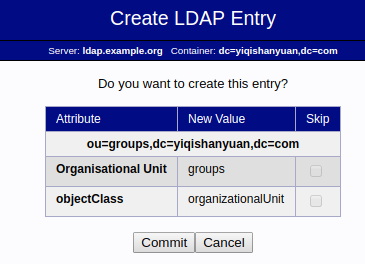
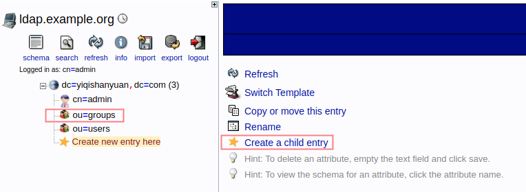

# OpenLDAP

- [Install using APT](#install-using-apt)
- [Install using docker](#install-using-docker)

## Prerequisites

- ubuntu server 16.04

## Install using APT

以Ubuntu server为例

- using apt-get

```bash
sudo apt-get update
sudo apt-get install slapd ldap-utils
```

安装过程中会让输入管理员密码

- reconfigure  slapd

```bash
sudo dpkg-reconfigure slapd
```

- reconfigure questions:

  - Omit OpenLDAP server configuration? No
  - DNS domain name: ldapserver.com
  - Organization name: development
  - Administrator password? set the admin password
  - Database backend? MDB
  - Remove the database when slapd is purged? No
  - Move old database? Yes
  - Allow LDAPv2 protocol? No

- config firewall

```bash
sudo ufw allow ldap
```

- test connection

```bash
ldapwhoami -H ldap:// -x
# output
anonymous
```

### Install phpLDAPadmin web interface

- using apt-get

```bash
sudo apt-get install phpldapadmin
```

- set config file

```bash
sudo cp /etc/phpldapadmin/config.php /etc/phpldapadmin/config.php.backup

sudo vim /etc/phpldapadmin/config.php
```

根据LDAP server配置，修改以下两项默认配置

```bash
$servers->setValue('server','base',array('dc=ldapserver,dc=com'));

$servers->setValue('login','bind_id','cn=admin,dc=ldapserver,dc=com');
```

- login using browser

```bash
domain_name_or_IP_address/phpldapadmin
```

## Install using docker

- download images

```bash
docker pull osixia/openldap
docker pull osixia/phpldapadmin
```

- config data volumes

```bash
mkdir -p /data/ldap

cd /data/ldap
mkdir data config

# data: 数据目录
# config: 配置文件目录
```

- run openldap

```bash
docker run --detach \
  --hostname ldap.example.org \
  --name ldap-service \
  -p 389:389 \
  -p 636:636 \
  -v /data/ldap/data:/var/lib/ldap \
  -v /data/ldap/config:/etc/ldap/slapd.d \
  --env LDAP_ORGANISATION="zhongyishanyuan" \
  --env LDAP_DOMAIN="yiqishanyuan.com" \
  --env LDAP_ADMIN_PASSWORD="admin" \
  --env LDAP_BASE_DN="yiqishanyuan.com" \
  --env LDAP_REPLICATION=true \
  --restart always \
  osixia/openldap:latest
```

- 查看admin信息

```bash
docker exec ldap-service ldapsearch -x -H ldap://localhost -b dc=yiqishanyuan,dc=com -D 'cn=admin,dc=yiqishanyuan,dc=com' -w admin
```

- run phpldapadmin

```bash
docker run --detach \
  --hostname phpldapadmin-service \
  --name phpldapadmin-service \
  --link ldap-service:ldap-host \
  --env PHPLDAPADMIN_LDAP_HOSTS="#PYTHON2BASH:[{'ldap.example.org': [{'server': [{'tls': True}]}, {'login': [{'bind_id': 'cn=admin,dc=yiqishanyuan,dc=com'}]}]}]" \
  -p 4431:443 \
  -p 8100:80 \
  --restart always \
  osixia/phpldapadmin:latest
```

## 创建 Organizational Units, Groups, and Users

- 登陆LDAP server

```bash
https:serverID:port
```


- 创建 Organisational Unit

我们创建两个ou，ou=groups和ou=users  
  
  
  

最终结果  
  

- 创建组(group)

选择上一级ou，点击"Create a child entry"  
  
  
  

- 创建用户

选择上一级ou，点击"Create a child entry"  
  
  

设置用户密码和group等信息项后，提交信息  

## Multi master replication（依据github官网文档测试，有bug）

- 启动ldap-service和ldap-service2

基于前面demo增加配置LDAP_REPLICATION

```bash
# ldap-service
docker run --detach \
  --hostname ldap.example.org --name ldap-service \
  -p 389:389 -p 636:636 \
  -v /data/ldap/data:/var/lib/ldap \
  -v /data/ldap/config:/etc/ldap/slapd.d \
  --env LDAP_ORGANISATION="zhongyishanyuan" \
  --env LDAP_DOMAIN="yiqishanyuan.com" \
  --env LDAP_ADMIN_PASSWORD="admin" \
  --env LDAP_BASE_DN="yiqishanyuan.com" \
  --env LDAP_REPLICATION=true \
  --restart always \
  osixia/openldap:latest

# ldap2-service
docker run --detach \
  --hostname ldap2.example.org --name ldap2-service \
  -v /data/ldap2/data:/var/lib/ldap \
  -v /data/ldap2/config:/etc/ldap/slapd.d \
  --env LDAP_ORGANISATION="zhongyishanyuan" \
  --env LDAP_DOMAIN="yiqishanyuan.com" \
  --env LDAP_ADMIN_PASSWORD="admin" \
  --env LDAP_BASE_DN="yiqishanyuan.com" \
  --env LDAP_REPLICATION=true \
  --restart always \
  osixia/openldap:latest
```

- 配置/etc/hosts

```bash
#Add the pair "ip hostname" to /etc/hosts on each containers,
#because ldap.example.org and ldap2.example.org are fake hostnames
docker exec ldap-service bash -c "echo $(docker inspect -f "{{ .NetworkSettings.IPAddress }}" ldap2-service) ldap2.example.org >> /etc/hosts"
docker exec ldap2-service bash -c "echo $(docker inspect -f "{{ .NetworkSettings.IPAddress }}" ldap-service) ldap.example.org >> /etc/hosts"
```

- check

```bash
docker exec ldap2-service ldapsearch -x -H ldap://localhost -b dc=yiqishanyuan,dc=com -D 'cn=admin,dc=yiqishanyuan,dc=com' -w admin
docker exec ldap-service ldapsearch -x -H ldap://localhost -b dc=yiqishanyuan,dc=com -D 'cn=zhangsan,ou=users,dc=yiqishanyuan,dc=com' -w 123456
```

## Glossary

- slapd

slapd is an LDAP directory server that runs on many different platforms.  
You can use it to provide a directory service of your very own.  
Your directory can contain pretty much anything you want to put in it.  
You can connect it to the global LDAP directory service, or run a service all by yourself.

## Reference

- [OpenLDAP intro](http://www.openldap.org/doc/admin24/intro.html)

- [install openldap in ubuntu(1)](https://www.digitalocean.com/community/tutorials/how-to-install-and-configure-openldap-and-phpldapadmin-on-ubuntu-16-04)

- [install openldap in ubuntu(2)](https://www.digitalocean.com/community/tutorials/how-to-install-and-configure-a-basic-ldap-server-on-an-ubuntu-12-04-vps)

- [docker openldap](https://github.com/osixia/docker-openldap)

- [docker phpLDAPadmin](https://github.com/osixia/docker-phpLDAPadmin)

- [openldap tutorial](https://sites.google.com/site/openldaptutorial/Home)