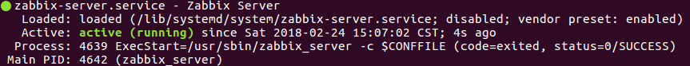
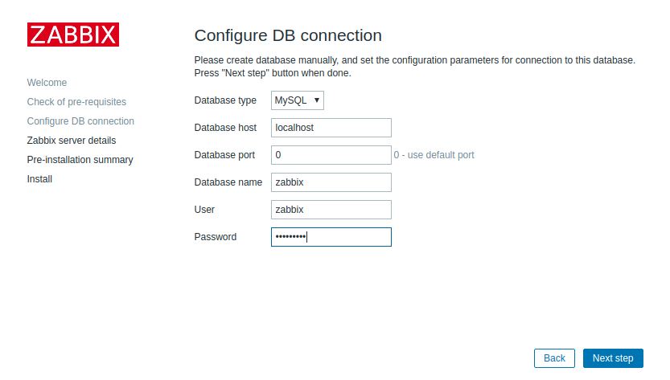
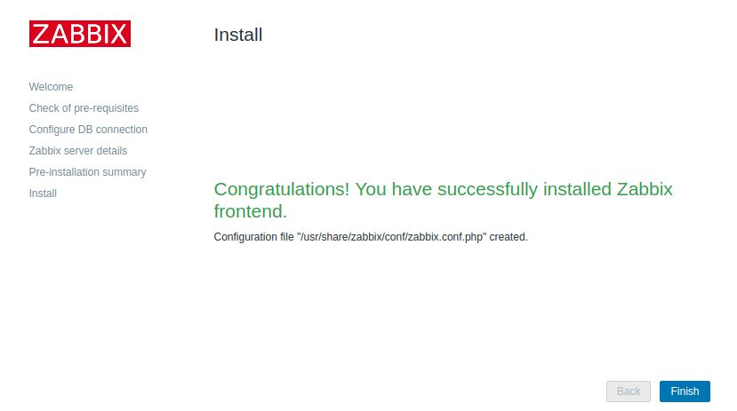

# Install and Config Zabbix

Zabbix is open-source monitoring software for networks and applications.It offers real-time monitoring of thousands of metrics collected from servers, virtual machines, and any other kind of network device.

Zabbix 是一个企业级的分布式开源监控方案。

> 支持docker吗？

## Prerequisites

- Ubuntu Server 16.04
- Apache
- MySQL
- PHP

## Installing the Zabbix Server

- update system's list of available packages

```bash
sudo apt-get update
```

- install the PHP modules Zabbix needs

```bash
sudo apt-get install php7.0-xml php7.0-bcmath php7.0-mbstring
```

- install Repository with MySQL database

```bash
wget http://repo.zabbix.com/zabbix/3.4/ubuntu/pool/main/z/zabbix-release/zabbix-release_3.4-1+xenial_all.deb

dpkg -i zabbix-release_3.4-1+xenial_all.deb

apt-get update
```

- install Zabbix server, frontend, agent

```bash
apt-get install zabbix-server-mysql zabbix-frontend-php zabbix-agent
```

## Configuring the MySQL Database For Zabbix

- log into MySQL as the root user using the root password

```bash
mysql -uroot -p
```

- create the Zabbix database with UTF-8 character support

```bash
create database zabbix character set utf8 collate utf8_bin;
```

- create a user that the Zabbix server will use

```bash
grant all privileges on zabbix.* to zabbix@localhost identified by 'Pass@1234';
```

- apply these new permissions

```bash
flush privileges;
```

- exit out of the database console

```bash
quit;
```

- import initial schema and data. You will be prompted to enter your newly created password.

```bash
zcat /usr/share/doc/zabbix-server-mysql/create.sql.gz | mysql -uzabbix -p zabbix
```

- configure the database for Zabbix server

```bash
# vim /etc/zabbix/zabbix_server.conf
DBHost=localhost
DBName=zabbix
DBUser=zabbix
DBPassword=Pass@1234
```

## Configuring PHP For Zabbix

- config timezone "Asia/Shanghai"

> [php supported time zones](http://php.net/manual/en/timezones.asia.php)

```bash
# sudo vim /etc/zabbix/apache.conf
<IfModule mod_php7.c>
    php_value max_execution_time 300
    php_value memory_limit 128M
    php_value post_max_size 16M
    php_value upload_max_filesize 2M
    php_value max_input_time 300
    php_value always_populate_raw_post_data -1
    php_value date.timezone Asia/Shanghai
</IfModule>
```

- restart Apache to apply new settings

```bash
sudo systemctl restart apache2
```

- now start the Zabbix server

```bash
sudo systemctl start zabbix-server
```

- check the Zabbix server

```bash
sudo systemctl status zabbix-server
```



- enable the server to start at boot time

```bash
sudo systemctl enable zabbix-server
```

## Configuring Settings for the Zabbix Web Interface

- in brower

```bash
http://your_zabbix_server_ip_address/zabbix/
```

- config MySQL connection



- finish



## installing and Configuring the Zabbix Agent

log into the second server, which we'll call the “monitored server”.

- install Repository with MySQL database

```bash
wget http://repo.zabbix.com/zabbix/3.4/ubuntu/pool/main/z/zabbix-release/zabbix-release_3.4-1+xenial_all.deb

dpkg -i zabbix-release_3.4-1+xenial_all.deb

apt-get update
```

- install Zabbix agent

```bash
apt-get install zabbix-agent
```

- generate a pre-shared keys (PSK)

```bash
sudo sh -c "openssl rand -hex 32 > /etc/zabbix/zabbix_agentd.psk"
```

- view psk

```bash
cat /etc/zabbix/zabbix_agentd.psk

# output like as
# 3e85184903823058956e8e5d4aba93785238b4927e2f276cec5fb2ae82fe2093
```

- config Zabbix server

```bash
sudo vim /etc/zabbix/zabbix_agentd.conf
```

```bash
##### Passive checks related

### Option: Server
#       List of comma delimited IP addresses (or hostnames) of Zabbix servers.
#       Incoming connections will be accepted only from the hosts listed here.
#       If IPv6 support is enabled then '127.0.0.1', '::127.0.0.1', '::ffff:127.0.0.1' are treated equally.
#
# Mandatory: no
# Default:
# Server=

Server=192.168.1.150
```

```bash
TLSConnect=psk
TLSAccept=psk
TLSPSKIdentity=PSK 001
TLSPSKFile=/etc/zabbix/zabbix_agentd.psk
```

- start the Zabbix agent and set it to start at boot time

```bash
sudo systemctl start zabbix-agent
sudo systemctl enable zabbix-agent
```

- check Zabbix agent status

```bash
sudo systemctl status zabbix-agent
```

```bash
sudo ufw allow 10050/tcp
```

## Error info

```bash
Get value from agent failed: TCP successful, cannot establish TLS to [[192.168.1.20]:10050]: connection closed by peer
```

## Reference

- [zabbix官网 download&config](https://www.zabbix.com/download)

- [zabbix官网 中文文档](https://www.zabbix.com/documentation/3.4/zh/manual/introduction/about)

- [install LAMP on ubuntu](https://www.digitalocean.com/community/tutorials/how-to-install-linux-apache-mysql-php-lamp-stack-on-ubuntu-16-04)

- [install on ubuntu](https://www.digitalocean.com/community/tutorials/how-to-install-and-configure-zabbix-to-securely-monitor-remote-servers-on-ubuntu-16-04)

- [zabbix_agentd config](https://www.zabbix.com/documentation/3.4/zh/manual/appendix/config/zabbix_agentd)
